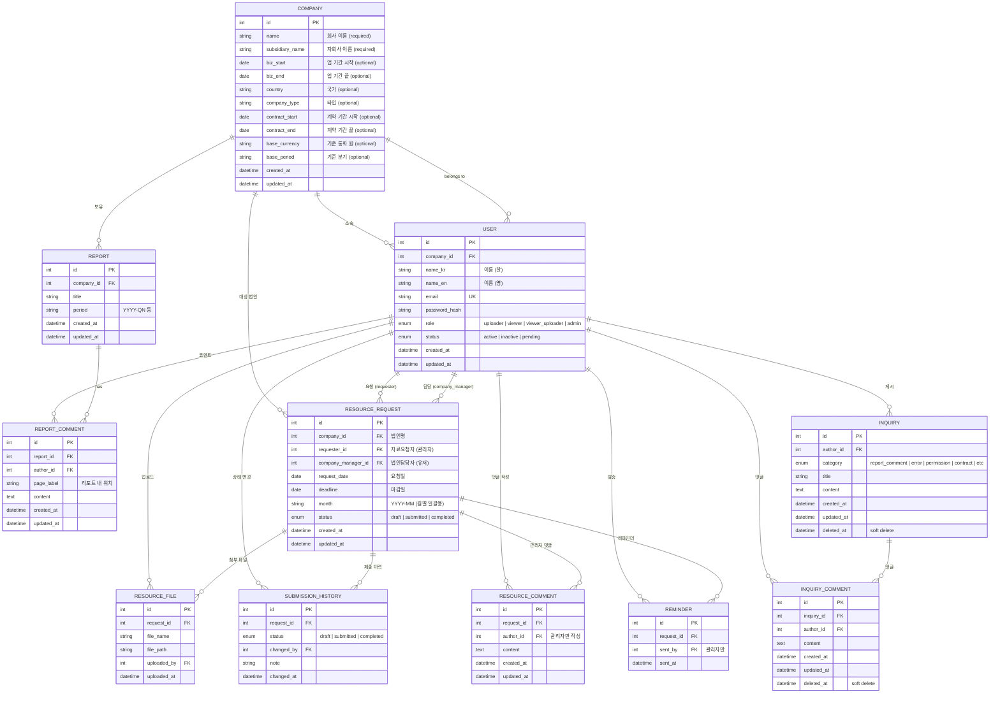

# EasyView ERD



## 권한별 메뉴 접근

| 메뉴            | uploader | viewer | viewer_uploader | admin |
|---------------|:--------:|:------:|:---------------:|:-----:|
| 서비스 소개      | O        | O      | O               | O     |
| 리포트          | X        | O      | O               | O     |
| 자료실(자료 요청) | O        | X      | O               | O     |
| 문의게시판       | O        | O      | O               | O     |
| 권한 관리        | X        | X      | X               | O     |

## 자료실 기능별 권한

| 기능                        | 유저      | 관리자    |
|----------------------------|-----------|-----------|
| 법인명·담당자·요청일·마감일·상태 | View only | Edit only |
| 제출 히스토리               | View only | View only |
| 댓글 (관리자 소통)           | Edit only | CRU       |
| 파일 업로드 (여러 개)        | CRUD      | CRUD      |
| 리마인더 발송               | X         | O         |

## 문의게시판 기능별 권한

| 카테고리            | 유저                  | 관리자                |
|--------------------|----------------------|----------------------|
| Report Comment     | 게시 CRU / 댓글 CRU   | 게시 CRUD / 댓글 CRUD |
| 오류 문의           | 게시 CRU / 댓글 CRU   | 게시 CRUD / 댓글 CRUD |
| 기타               | 게시 CRU / 댓글 CRU   | 게시 CRUD / 댓글 CRUD |
| 사용자추가/권한요청  | 게시 CRU / 댓글 CRU   | 게시 CRUD / 댓글 CRUD |
| 계약 문의           | 게시 CRU / 댓글 CRU   | 게시 CRUD / 댓글 CRUD |
```
