# EasyView ERD (업데이트)

> **범위:** 현재 DB 구조(AS-IS) + 기획 요구사항 반영(TO-BE)
> **최종 갱신:** 2026-04-24
> **상태:** 기획 반영 초안 — 배포 전 백엔드 개발자 검토 필요

---

## 📑 목차

1. [개요 & 범례](#1-개요--범례)
2. [AS-IS: 현재 DB 구조](#2-as-is-현재-db-구조)
3. [TO-BE: 기획 반영 ERD](#3-to-be-기획-반영-erd)
4. [DB 누락 영역 검토](#4-db-누락-영역-검토)
5. [리포트 관리 워크플로우](#5-리포트-관리-워크플로우)
6. [법인별 접근 권한](#6-법인별-접근-권한)
7. [Power Automate 메일 발송 연동](#7-power-automate-메일-발송-연동)
8. [청구서 (서비스 준비중)](#8-청구서-서비스-준비중)
9. [김삼일 AI 에이전트 강화](#9-김삼일-ai-에이전트-강화)
10. [FAQ 시스템](#10-faq-시스템)
11. [권한 매트릭스](#11-권한-매트릭스)

---

## 1. 개요 & 범례

### 주요 변경 요약

| 영역 | AS-IS | TO-BE | 비고 |
|------|-------|-------|------|
| 자료실 | `data_request` + `request_file`만 존재 | Accept 상태/제출이력/리마인더 정식 추가 | 2번 요구 |
| 리포트 관리 | **없음** | `report` + `report_file` + `report_version` 신설 | 3번 요구 |
| 법인별 권한 | `user_permissions`만 (기능 단위) | `user_company_access` 추가 (법인 단위) | 4번 요구 |
| 이메일 발송 | `email_service.py` (직접 발송) | `email_notification` 로그 + Power Automate 웹훅 | 1번 요구 |
| 청구서 | 없음 | `invoice` 신규 (서비스 준비중 placeholder) | 5번 요구 |
| 김삼일 AI 에이전트 | Function Calling 뼈대만 | `chat_session` + `agent_intent` + `navigation_link` 추가 (페이지 안내/실행) | 6번 요구 |
| FAQ | 없음 | `faq` + `faq_category` + `faq_feedback` + `faq_link` 신설 | 7번 요구 |

### ERD 범례

```
PK   = Primary Key
FK   = Foreign Key
UK   = Unique Key
?    = Optional
🆕   = TO-BE 신규 엔티티
🔧   = TO-BE 필드 추가/변경
⏸    = 서비스 준비중 (placeholder)
```

---

## 2. AS-IS: 현재 DB 구조

현재 `backend/models.py` + `backend/admin_models.py` 기반.

```mermaid
erDiagram
    USERS {
        int id PK
        string email UK
        string name
        string company
        int group_id FK
        string role "admin | manager | viewer"
        string status "active | inactive | pending"
        string trust_level
        bool two_fa
        string hashed_password
        datetime password_expiry
        datetime last_login
        datetime created_at
    }

    GROUPS {
        int id PK
        string name
        string company
        string default_role
        int report_count
        datetime created_at
    }

    COMPANIES {
        int id PK
        string name UK
        string subsidiary_name
        date biz_start
        date biz_end
        string country
        string company_type
        date contract_start
        date contract_end
        string base_currency
        string base_period
        datetime created_at
        datetime updated_at
    }

    SUBSIDIARIES {
        int id PK
        string name
        int company_id FK
        datetime created_at
    }

    ROLES {
        int id PK
        string name
        string category "pwc | client"
        text description
        text permissions
        datetime created_at
    }

    REPORT_PERMISSIONS {
        int id PK
        string report_name
        string role
        bool can_view
        bool can_download
        bool can_print
        bool can_share
        bool can_comment
    }

    USER_PERMISSIONS {
        int id PK
        int user_id FK
        bool can_view_report
        bool can_upload
        bool can_pdf
        bool can_excel
        bool can_print
        bool can_share
        bool can_comment
        bool can_request_user
    }

    USER_ADD_REQUESTS {
        int id PK
        int requester_id FK
        string target_name
        string target_email
        string reason
        string status "pending | approved | rejected"
        int reviewer_id FK
        datetime created_at
    }

    AUDIT_LOGS {
        int id PK
        datetime timestamp
        string actor
        string action_type
        string detail
        string target
        string ip_address
    }

    INQUIRY {
        int id PK
        string category
        string title
        text content
        string author
        string corporation
        bool is_secret
        string status "답변대기 | 답변완료"
        text reply
        datetime reply_at
        datetime created_at
    }

    DATA_REQUEST {
        int id PK
        string req_code "REQ-001"
        string title
        string entity
        string assignee
        string requester
        string status "초안 | submitted | accepted"
        string priority
        string due_date
        text description
        datetime created_at
    }

    REQUEST_FILE {
        int id PK
        int request_id FK
        string filename
        string original_name
        string uploader
        int size
        datetime uploaded_at
    }

    TB_ACCOUNT {
        string account_code PK
        string account_name
        string disclosure_acct
        string category
        string section
        float opening_balance
        float opening_signed
    }

    JE {
        int record_id PK
        date date
        string year_month
        string voucher_no
        string dr_cr
        float amount
        float signed_amount
        string counterparty
        string account_code
        string section
    }

    USERS       }o--||  GROUPS        : "소속"
    USERS       ||--o{  USER_PERMISSIONS : "개별 권한"
    USERS       ||--o{  USER_ADD_REQUESTS : "요청자"
    COMPANIES   ||--o{  SUBSIDIARIES  : "자회사"
    DATA_REQUEST ||--o{ REQUEST_FILE  : "첨부"
    JE          }o--||  TB_ACCOUNT    : "계정"
```

**현 구조 한계점:**

- `DATA_REQUEST`의 `status`는 문자열이지만 `accepted` 전환 이후 리포트 관리로 이관되는 경로가 정의되지 않음
- `USER_PERMISSIONS`는 기능 단위 ON/OFF만 — 어느 법인에 접근 가능한지 구분 불가
- 이메일 발송 로그/이력 테이블 없음
- 리포트 생성/버전/배포 관리 테이블 전무

---

## 3. TO-BE: 기획 반영 ERD

### 3-1. 관리자 / 사용자 / 회사 (기존 강화)

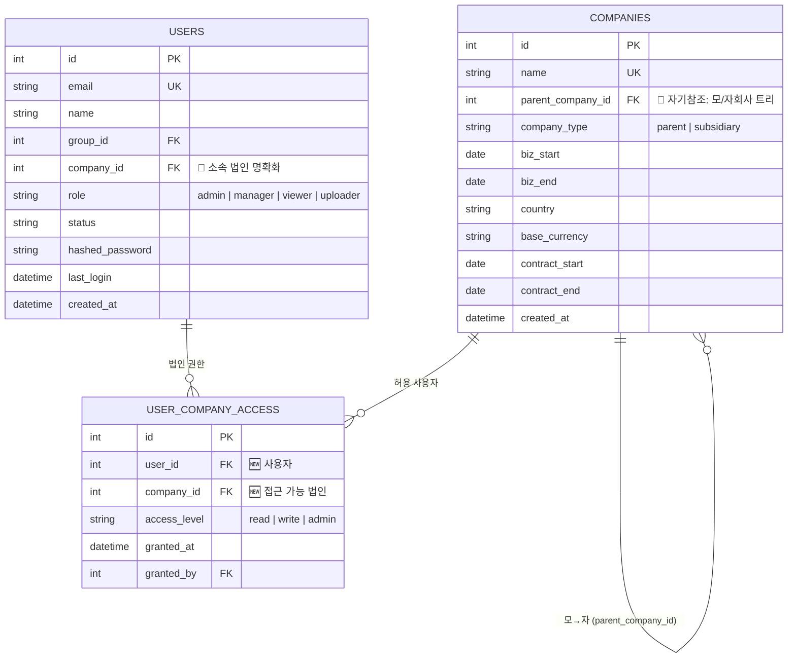

**변경 포인트:**

- 🔧 `USERS.company`(string) → `USERS.company_id`(FK) 로 정규화
- 🔧 `COMPANIES`에 `parent_company_id` 추가 → 자기참조로 모/자회사 트리 관리 (기존 `SUBSIDIARIES` 별도 테이블 대체 고려)
- 🆕 `USER_COMPANY_ACCESS` 신설 → **4번 요구사항 해결** (사용자별 접근 가능 법인 지정)

### 3-2. 자료실 강화

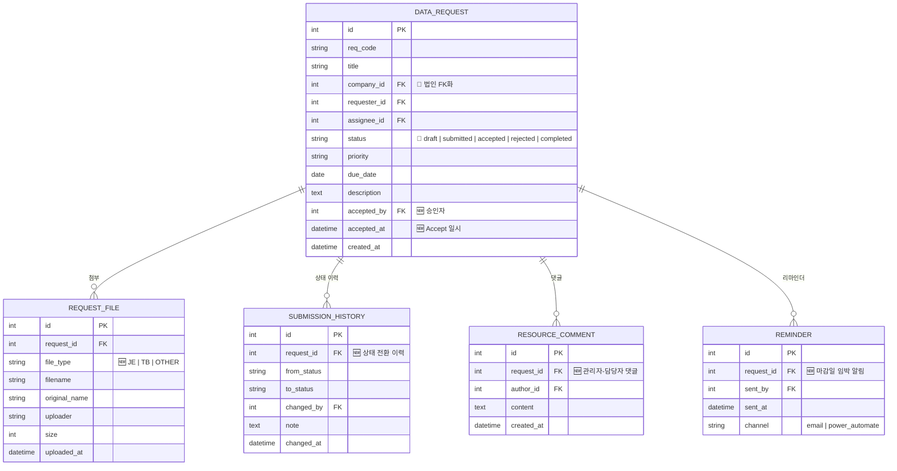

**변경 포인트:**

- 🆕 `SUBMISSION_HISTORY`: 상태 전환 이력 추적 (draft → submitted → accepted)
- 🆕 `RESOURCE_COMMENT`: 관리자-담당자 소통 댓글
- 🆕 `REMINDER`: 리마인더 발송 이력 (Power Automate 연동)
- 🔧 `DATA_REQUEST.status`에 `accepted`/`rejected` 공식화
- 🔧 `REQUEST_FILE.file_type` 추가 → JE/TB 구분해서 리포트 생성 단계로 전달

### 3-3. 리포트 관리 (🆕 신규)

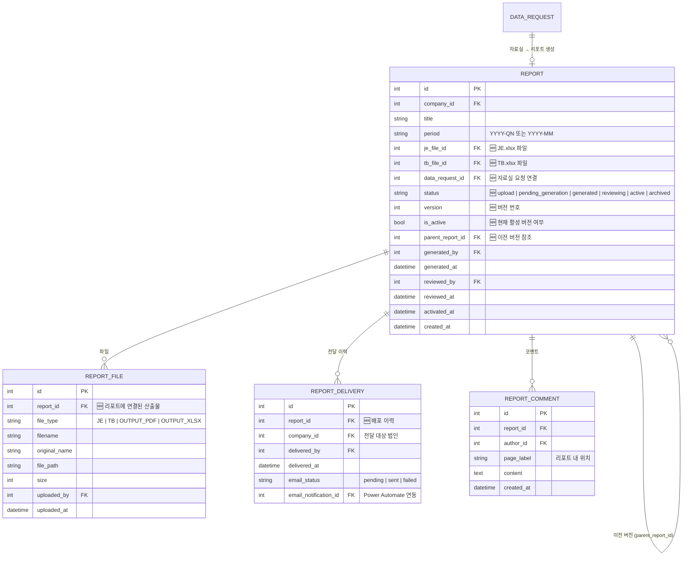

**리포트 상태 전이:**

```
upload ──→ pending_generation ──→ generated ──→ reviewing ──→ active ──→ archived
                                                              │
                                                              └ 새 버전 생성 시 이전 active → archived
```

### 3-4. 문의게시판 (기존 + 확장)

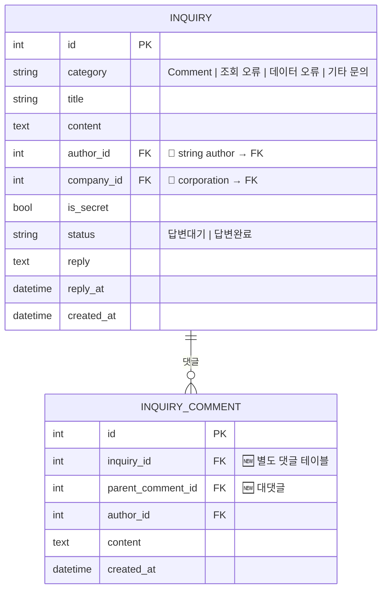

**변경 포인트:**

- 🔧 `author` 문자열 → `author_id` FK
- 🔧 `corporation` 문자열 → `company_id` FK
- 🆕 `INQUIRY_COMMENT` 별도 테이블 (현재는 `reply` 단일 필드만 있어 대댓글/다중 답변 불가)

### 3-5. 이메일 발송 로그 (🆕 Power Automate 연동)

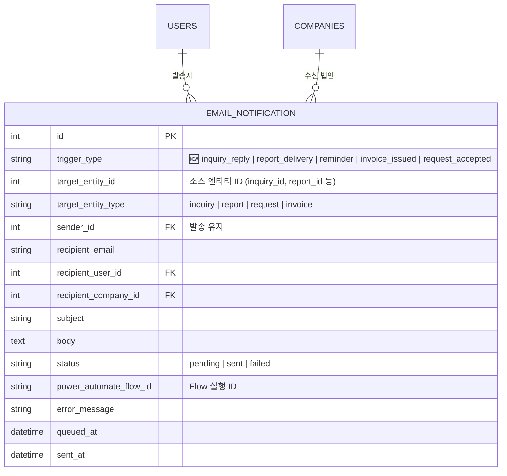

**Power Automate 연동 흐름:**

```
[Event 발생]
   │
   ▼
[Backend] EMAIL_NOTIFICATION INSERT (status=pending)
   │
   ▼
[Backend] Power Automate Webhook 호출
   │        └─ payload: notification_id, type, recipient, body
   ▼
[Power Automate Flow] 고객사/담당자에게 메일 발송
   │
   ▼
[Callback] EMAIL_NOTIFICATION UPDATE (status=sent/failed, flow_id)
```

---

## 4. DB 누락 영역 검토

| 영역 | 현재 상태 | 필요 여부 | 조치 |
|------|-----------|----------|------|
| 자료실 Accept 플로우 | 상태 문자열만 존재 | **필요** | SUBMISSION_HISTORY, RESOURCE_COMMENT, REMINDER 추가 |
| 리포트 관리 | **전무** | **필수** | REPORT, REPORT_FILE, REPORT_DELIVERY 신설 |
| 법인별 권한 | user_permissions만 (기능 단위) | **필요** | USER_COMPANY_ACCESS 추가 |
| 이메일 발송 로그 | 없음 | **필수** | EMAIL_NOTIFICATION 추가 |
| 리포트 댓글 | 없음 | **필요** | REPORT_COMMENT 추가 |
| 청구서 | 없음 | **향후** | INVOICE placeholder (서비스 준비중) |
| 김삼일 AI 에이전트 | Function Calling만 (뼈대) | **필요** | CHAT_SESSION + AGENT_INTENT + NAVIGATION_LINK (9번 참조) |
| FAQ | 없음 | **필요** | FAQ + FAQ_CATEGORY 신설 (10번 참조) |
| 사용자-회사 관계 | 문자열 company | **필요** | USERS.company_id FK화 |
| 대댓글 | 단일 reply 필드 | **선택** | INQUIRY_COMMENT 별도 테이블 |

---

## 5. 리포트 관리 워크플로우

### 관리자 페이지 구조

```
관리자 메뉴
├── 유저관리 (기존 USERS + USER_PERMISSIONS + USER_COMPANY_ACCESS)
├── 회사관리 (기존 COMPANIES + 모/자회사 트리)
├── 리포트관리 (🆕)
│   ├── 업로드 탭
│   │   └── 자료실 Accept 상태 데이터 표시
│   └── 현황 탭
│       ├── 리포트 생성 대기
│       └── 리포트 생성 완료
└── 청구서 (⏸ 서비스 준비중)
```

### 전체 플로우 다이어그램

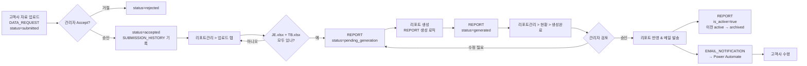

### 모회사/자회사별 모니터링

`REPORT.company_id` + `COMPANIES.parent_company_id` 조합으로:

```sql
-- 예시: 모회사별 총 산출물 현황
SELECT
    p.name AS 모회사,
    c.name AS 법인,
    COUNT(r.id) AS 전체_리포트,
    SUM(CASE WHEN r.is_active THEN 1 ELSE 0 END) AS 활성_리포트,
    SUM(CASE WHEN r.status='archived' THEN 1 ELSE 0 END) AS 비활성_리포트
FROM companies c
LEFT JOIN companies p ON c.parent_company_id = p.id
LEFT JOIN report r ON r.company_id = c.id
GROUP BY p.name, c.name;
```

---

## 6. 법인별 접근 권한

### 권한 모델 변화

```
AS-IS:  USERS.role + USER_PERMISSIONS (기능 ON/OFF)
        └─ 문제: 특정 법인 리포트만 볼 수 있도록 제한 불가

TO-BE:  USERS.role + USER_PERMISSIONS (기능 ON/OFF)
      + USER_COMPANY_ACCESS (법인 접근 제어)  🆕
```

### USER_COMPANY_ACCESS 사용 예시

| user_id | company_id | access_level | 의미 |
|---------|------------|-------------|------|
| 1 | 10 (삼성전자) | read | 조회만 가능 |
| 1 | 11 (삼성SDS) | write | 조회 + 자료업로드 |
| 2 | 10 (삼성전자) | admin | 전체 관리 |

### 쿼리 예시 (리포트 목록 필터링)

```python
# 현재 로그인 유저가 볼 수 있는 리포트만
reports = (
    db.query(Report)
    .join(UserCompanyAccess, UserCompanyAccess.company_id == Report.company_id)
    .filter(UserCompanyAccess.user_id == current_user.id)
    .filter(Report.is_active == True)
    .all()
)
```

---

## 7. Power Automate 메일 발송 연동

### 연동 트리거 목록

| trigger_type | 발생 시점 | 수신자 |
|-------------|---------|-------|
| `inquiry_reply` | 문의 답변 등록 | 문의 작성자 |
| `request_accepted` | 자료실 Accept | 요청자 (고객사 담당) |
| `reminder` | 자료실 마감 임박 | 담당자 |
| `report_delivery` | 리포트 활성 전환 | 고객사 담당자 |
| `invoice_issued` | 청구서 발행 (향후) | 재무 담당 |

### 구현 패턴 (권장)

```python
# backend/email_service.py (확장)
def trigger_power_automate(notification_id: int):
    noti = db.query(EmailNotification).get(notification_id)
    webhook_url = settings.POWER_AUTOMATE_WEBHOOK_URL
    payload = {
        "notification_id": noti.id,
        "type": noti.trigger_type,
        "recipient": noti.recipient_email,
        "subject": noti.subject,
        "body": noti.body,
    }
    try:
        resp = requests.post(webhook_url, json=payload, timeout=10)
        noti.status = "sent"
        noti.power_automate_flow_id = resp.json().get("flow_run_id")
        noti.sent_at = datetime.now()
    except Exception as e:
        noti.status = "failed"
        noti.error_message = str(e)
    db.commit()
```

---

## 8. 청구서 (서비스 준비중) ⏸

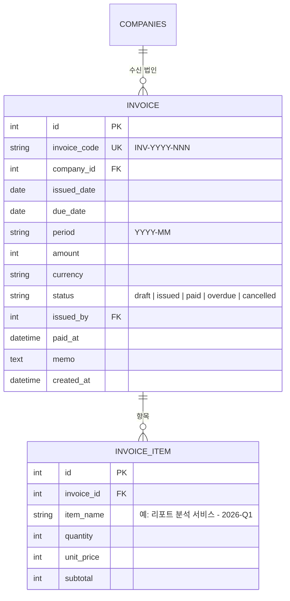

> **⏸ 주의:** 청구서 기능은 서비스 준비중입니다. ERD만 선반영하며 실제 구현은 추후 진행합니다. 관리자 페이지에서 "서비스 준비중" placeholder로 표시됩니다.

---

## 9. 김삼일 AI 에이전트 강화

**목표:** 단순 Q&A가 아닌 **페이지를 이해하고 사용자 의도를 처리해주는 에이전트**로 발전.
예시: "다크모드 어떻게 해?" → 설명 + Settings 페이지 링크 제공 / "매출 이상한 점 있어?" → 데이터 조회 + 원인 분석 + 관련 페이지 이동

### 9-1. 핵심 설계

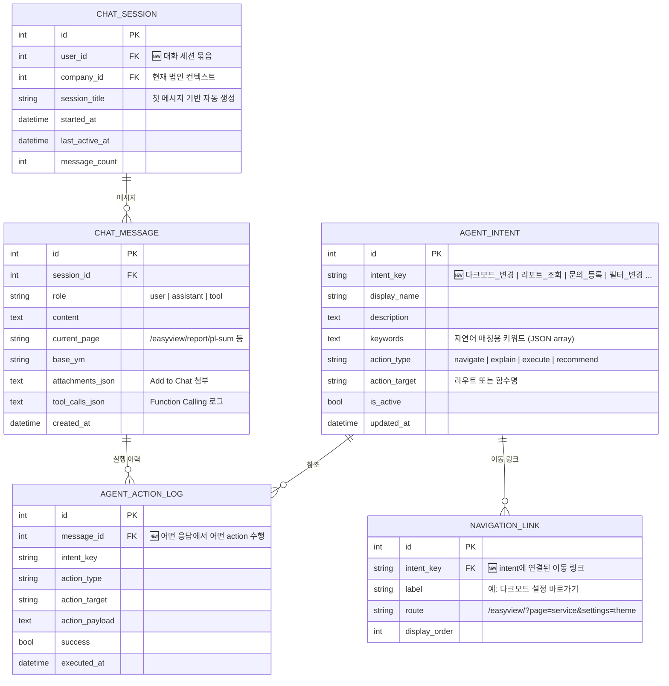

### 9-2. 에이전트 능력 분류

| 카테고리 | 예시 질문 | 처리 방식 | DB 연계 |
|---------|---------|---------|---------|
| **🧭 페이지 안내** | "다크모드 어떻게 바꿔?" | 설명 + 링크 제공 | `AGENT_INTENT` + `NAVIGATION_LINK` |
| **📊 데이터 분석** | "9월 매출 이상한 점 있어?" | Function Calling으로 DB 조회 | `JE`, `REPORT`, 기존 tools |
| **🔍 인사이트 제공** | "이번 분기 주의할 계정은?" | 시나리오 분석 자동 실행 | `SCENARIO_*` tools |
| **📝 업무 지원** | "이 내용으로 문의 등록해줘" | 양식 자동 작성 + CommentPanel 열기 | `INQUIRY` CREATE |
| **⚙️ 설정 변경** | "알림 꺼줘" | 사용자 설정 직접 변경 | `USER_PREFERENCES` (별도) |

### 9-3. 페이지별 컨텍스트 이해

현재 `ChatBot.tsx`의 `activePage` prop을 확장:

```typescript
interface AgentContext {
  currentPage: string;           // pl-sum, bs-trend, resource 등
  currentPath: string;           // 전체 URL path
  userRole: string;              // admin / manager / viewer
  accessibleCompanies: number[]; // USER_COMPANY_ACCESS 기반
  activeFilters: {               // 필터 상태
    baseYm: string;
    periodType: string;
    selectedItems: string[];     // 하이라이트 중인 항목
  };
  attachments: ChatAttachment[]; // Add to Chat 첨부
}
```

### 9-4. Intent 예시 (시드 데이터)

| intent_key | display_name | keywords | action_type | action_target |
|-----------|-------------|---------|------------|-------------|
| `theme_dark` | 다크모드 전환 | ["다크모드", "어두운", "밤모드"] | navigate | `/easyview/?page=service&settings=theme&to=dark` |
| `theme_light` | 라이트모드 전환 | ["라이트모드", "밝게"] | navigate | `/easyview/?page=service&settings=theme&to=light` |
| `report_pl_summary` | PL 요약 페이지 | ["손익", "매출", "영업이익"] | navigate | `/easyview/?page=report&sub=pl-sum` |
| `inquiry_create` | 문의 등록 | ["문의", "질문하고싶", "궁금"] | execute | `open_comment_panel` |
| `scenario_check` | 이상전표 확인 | ["이상", "중복", "주말"] | explain+navigate | `/easyview/?page=report&sub=sc-dup` |
| `faq_search` | FAQ 검색 | ["자주 묻는", "FAQ"] | navigate | `/easyview/?page=inquiry&tab=faq` |

### 9-5. 응답 포맷 (확장)

```json
{
  "reply": "다크모드는 설정 페이지에서 바꿀 수 있어요! 🌙",
  "actions": [
    {
      "type": "navigate",
      "label": "다크모드 설정 바로가기",
      "route": "/easyview/?page=service&settings=theme"
    },
    {
      "type": "quick_execute",
      "label": "지금 바로 다크모드 켜기",
      "handler": "applyTheme('dark')"
    }
  ]
}
```

---

## 10. FAQ 시스템

**목표:** 문의게시판 하위에 FAQ 탭을 추가해 자주 묻는 질문은 AI보다 정적 답변으로 빠르게 해결.

### 10-1. ERD

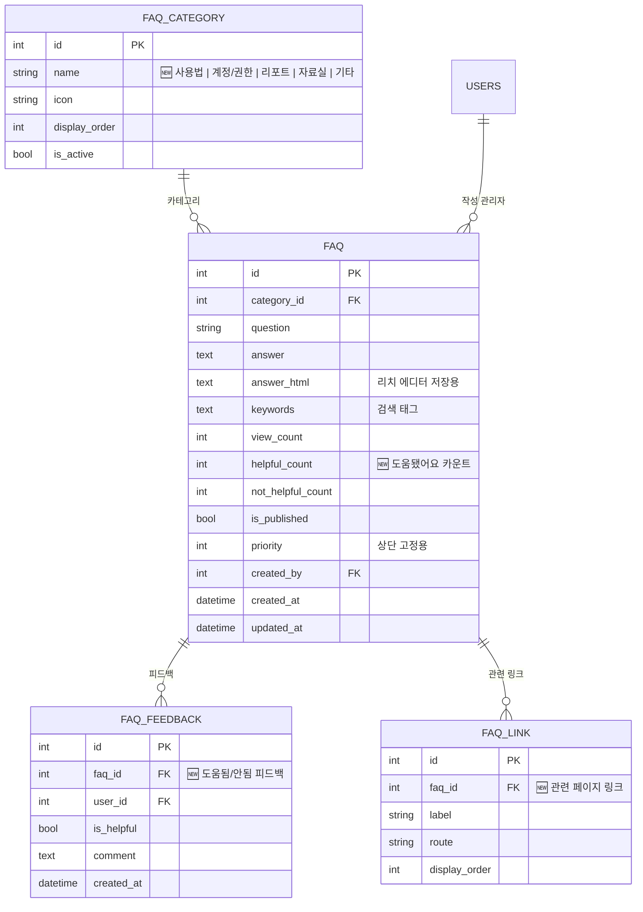

### 10-2. 문의게시판 탭 구조

```
문의게시판
├── 💬 문의 탭 (기존 INQUIRY)
└── ❓ FAQ 탭 🆕
    ├── 카테고리 목록 (FAQ_CATEGORY)
    └── FAQ 리스트
        ├── 질문/답변
        ├── 👍 도움됐어요 / 👎 도움안됨 (FAQ_FEEDBACK)
        └── 관련 링크 (FAQ_LINK)
```

### 10-3. FAQ ↔ AI 에이전트 연계

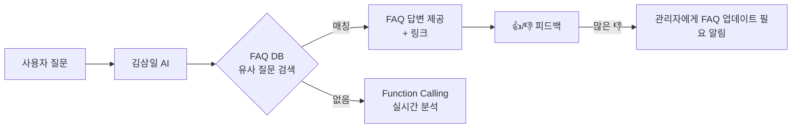

### 10-4. 관리자 FAQ 관리 기능

| 기능 | 권한 | 엔드포인트 (예정) |
|------|-----|------------------|
| FAQ 목록 조회 | 모두 | `GET /api/faq` |
| FAQ 상세 조회 | 모두 | `GET /api/faq/{id}` |
| FAQ 작성 | admin | `POST /api/faq` |
| FAQ 수정 | admin | `PUT /api/faq/{id}` |
| FAQ 삭제 | admin | `DELETE /api/faq/{id}` |
| 카테고리 관리 | admin | `GET/POST /api/faq/categories` |
| 피드백 조회 (통계) | admin | `GET /api/faq/{id}/feedback` |
| 도움됨 카운트 | 로그인 | `POST /api/faq/{id}/helpful` |

### 10-5. 초기 FAQ 시드 예시

| category | question | action_links |
|---------|---------|--------------|
| 사용법 | 다크모드는 어떻게 설정하나요? | `/easyview/?page=service&settings=theme` |
| 계정/권한 | 비밀번호를 변경하려면? | `/easyview/?page=service&settings=password` |
| 리포트 | 리포트 기간은 어디서 바꾸나요? | (현재 페이지 필터바 하이라이트) |
| 리포트 | 증감률은 어떤 기준으로 계산되나요? | `/easyview/?page=report&sub=summary` |
| 자료실 | 파일 업로드가 안 돼요 | `/easyview/?page=resource` |

---

## 11. 권한 매트릭스

### 11-1. 메뉴별 접근 권한

| 메뉴 | uploader | viewer | viewer_uploader | manager | admin |
|------|:-:|:-:|:-:|:-:|:-:|
| 서비스 소개 | O | O | O | O | O |
| 리포트 (법인별 제한) | X | O | O | O | O |
| 자료실 | O | X | O | O | O |
| 문의게시판 | O | O | O | O | O |
| 관리자 > 유저관리 | X | X | X | X | O |
| 관리자 > 회사관리 | X | X | X | X | O |
| 관리자 > 리포트관리 | X | X | X | O | O |
| 관리자 > 청구서 ⏸ | X | X | X | X | O |

### 11-2. 리포트 관리 기능별 권한

| 기능 | viewer | manager | admin |
|------|:-:|:-:|:-:|
| 업로드 탭 조회 | - | O | O |
| JE/TB 업로드 | - | O | O |
| 리포트 생성 | - | O | O |
| 현황 탭 조회 | - | O | O |
| 리포트 검토 | - | O | O |
| 리포트 반영 & 메일 발송 | - | - | O |

### 11-3. 자료실 기능별 권한 (Accept 포함)

| 기능 | 유저(uploader) | 관리자(admin) |
|------|:-:|:-:|
| 법인명·담당자·요청일·마감일·상태 | View only | Edit only |
| 제출 히스토리 | View only | View only |
| 댓글 (관리자 소통) | Edit only | CRU |
| 파일 업로드 (JE/TB 구분) | CRUD | CRUD |
| **Accept 처리** 🆕 | X | O |
| 리마인더 발송 | X | O |

---

## 📎 부록: 마이그레이션 체크리스트

백엔드 개발자가 이 ERD를 실제 적용할 때 체크할 사항:

- [ ] `USERS.company` (string) → `USERS.company_id` (FK) 마이그레이션 스크립트
- [ ] `COMPANIES.parent_company_id` 추가 (기존 `SUBSIDIARIES` 데이터 이관 검토)
- [ ] `USER_COMPANY_ACCESS` 테이블 신설 + 기존 사용자 일괄 seed
- [ ] `DATA_REQUEST.status` enum 명확화 + `accepted_by`, `accepted_at` 추가
- [ ] `SUBMISSION_HISTORY`, `RESOURCE_COMMENT`, `REMINDER` 신설
- [ ] `REPORT`, `REPORT_FILE`, `REPORT_DELIVERY`, `REPORT_COMMENT` 신설
- [ ] `EMAIL_NOTIFICATION` 신설 + `email_service.py` 리팩터 (Power Automate 연동)
- [ ] `INQUIRY.author`, `corporation` FK화 (선택)
- [ ] `INVOICE`, `INVOICE_ITEM` placeholder 테이블 (향후)
- [ ] 각 권한 체크 엔드포인트에 `USER_COMPANY_ACCESS` 쿼리 추가
- [ ] `CHAT_SESSION`, `CHAT_MESSAGE`, `AGENT_INTENT`, `NAVIGATION_LINK`, `AGENT_ACTION_LOG` 신설 (AI 에이전트)
- [ ] `backend/routers/chat.py` 확장 — actions 배열 응답 포맷, intent 매칭 로직
- [ ] 프론트엔드 `ChatBot.tsx` — actions 렌더링 (navigate/execute 버튼)
- [ ] `FAQ`, `FAQ_CATEGORY`, `FAQ_FEEDBACK`, `FAQ_LINK` 신설
- [ ] 문의게시판 프론트에 FAQ 탭 추가
- [ ] FAQ 관리 엔드포인트 (admin CRUD)
- [ ] AI 에이전트 ↔ FAQ 연계 (유사 질문 매칭 우선 처리)

---

*Last Updated: 2026-04-24 — 기획 요구사항 7건 반영 초안 (v2)*
- v1: Power Automate, 자료실 강화, 리포트 관리, 법인별 권한, 청구서
- v2: 김삼일 AI 에이전트 강화, FAQ 시스템
